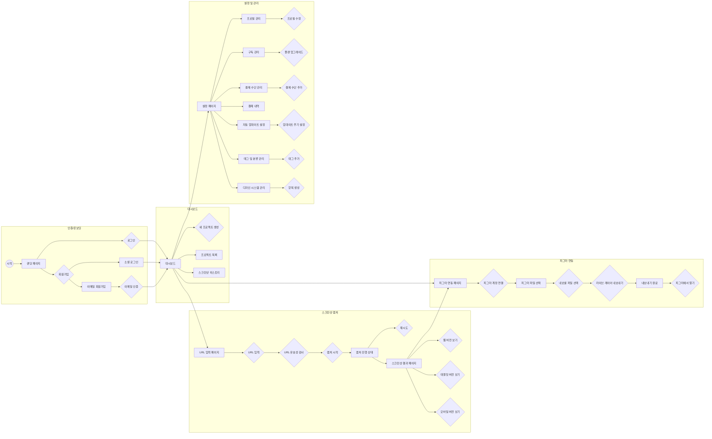

```mermaid
flowchart LR

  subgraph s1 ["인증/온보딩"]
    n1(("시작"))
    n2["랜딩 페이지"]
    n3{"회원가입"}
    n4{"로그인"}
    n5["이메일 회원가입"]
    n6["소셜 로그인"]
    n7{"이메일 인증"}
  end

  subgraph s2 ["대시보드"]
    n8["대시보드"]
    n9{"새 프로젝트 생성"}
    n10["프로젝트 목록"]
    n11["스크린샷 히스토리"]
  end

  subgraph s3 ["스크린샷 캡처"]
    n12["URL 입력 페이지"]
    n13{"URL 입력"}
    n14{"URL 유효성 검사"}
    n15{"캡처 시작"}
    n16["캡처 진행 상태"]
    n17{"재시도"}
    n18["스크린샷 결과 페이지"]
    n19{"웹 버전 보기"}
    n20{"태블릿 버전 보기"}
    n21{"모바일 버전 보기"}
  end

  subgraph s4 ["피그마 연동"]
    n22["피그마 연동 페이지"]
    n23{"피그마 계정 연결"}
    n24["피그마 파일 선택"]
    n25{"내보낼 파일 선택"}
    n26{"라이브 레이어 내보내기"}
    n27["내보내기 완료"]
    n28{"피그마에서 열기"}
  end

  subgraph s5 ["설정 및 관리"]
    n29["설정 페이지"]
    n30["프로필 관리"]
    n31{"프로필 수정"}
    n32["구독 관리"]
    n33{"플랜 업그레이드"}
    n34["결제 수단 관리"]
    n35{"결제 수단 추가"}
    n36["결제 내역"]
    n37["자동 업데이트 설정"]
    n38{"업데이트 주기 설정"}
    n39["태그 및 분류 관리"]
    n40{"태그 추가"}
    n41["디자인 시스템 관리"]
    n42{"항목 생성"}
  end

  n1 --> n2
  n2 --> n3
  n2 --> n4
  n3 --> n5
  n3 --> n6
  n5 --> n7
  n4 --> n8
  n6 --> n8
  n7 --> n8
  n8 --> n9
  n8 --> n10
  n8 --> n11
  n8 --> n12
  n12 --> n13
  n13 --> n14
  n14 --> n15
  n15 --> n16
  n16 --> n17
  n16 --> n18
  n18 --> n19
  n18 --> n20
  n18 --> n21
  n8 --> n22
  n22 --> n23
  n23 --> n24
  n24 --> n25
  n25 --> n26
  n26 --> n27
  n27 --> n28
  n18 --> n22
  n8 --> n29
  n29 --> n30
  n30 --> n31
  n29 --> n32
  n32 --> n33
  n29 --> n34
  n34 --> n35
  n29 --> n36
  n29 --> n37
  n37 --> n38
  n29 --> n39
  n39 --> n40
  n29 --> n41
  n41 --> n42
```
